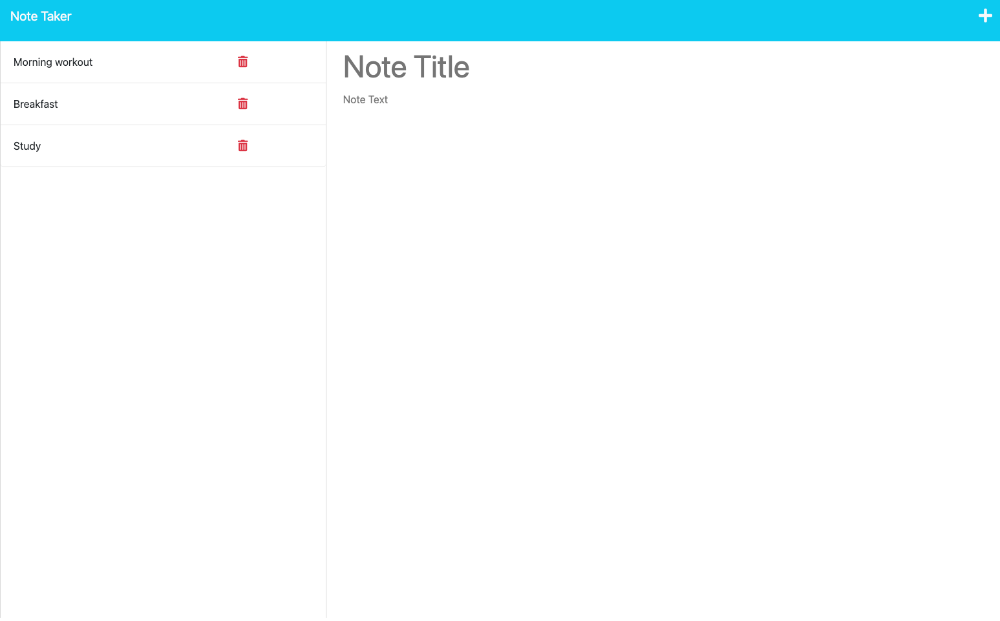

# Note-Taker
  
   
 
 
 
  This project is an application called Note Taker that can be used to write and save notes. This application uses an Express.js back end and will save and retrieve note data from a JSON file.
 
  

  ## Table of Contents

  - [Installation](#installation)
  - [Usage](#usage)
  - [Deployment](#deployment)
  - [Contribution](#contribution)
  - [Testing](#testing)
  - [License](#license)
  - [Questions](#questions)

  
  ## Installation

  Just click on the link to the deployed application on Heroku

  

  ## Usage

  Enter a note title and then the note text and click on save 
  
  ## Deployment

  [Here's the link to the deployed application](https://note-ta-982de7554cb2.herokuapp.com/notes)
 
  

  ## Contribution 

  Please create an issue first

  

  ## Testing 

  run npm test

  

  ## License 

     Copyright 2023 Youssef Karoui    Permission is hereby granted, free of charge, to any person obtaining a copy of this software and associated documentation files (the “Software”), to deal in the Software without restriction, including without limitation the rights to use, copy, modify, merge, publish, distribute, sublicense, and/or sell copies of the Software, and to permit persons to whom the Software is furnished to do so, subject to the following conditions: The above copyright notice and this permission notice shall be included in all copies or substantial portions of the Software.

  If you would like to know more about licensing information here's a link for more details: https://opensource.org/license/mit/

  

  ## Questions 

  [Email me if you have any questions](mailto:youssefkaroui6@gmail.com)

[Review my other projects on GitHub.](https://www.github.com/youssefkaroui)

  